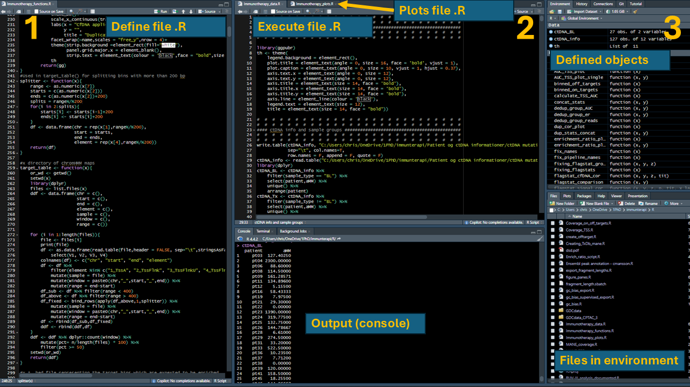
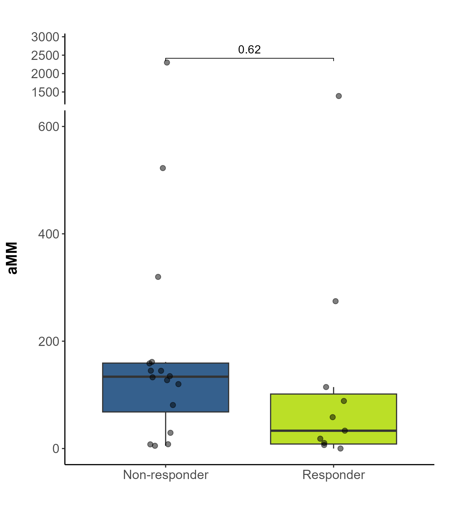
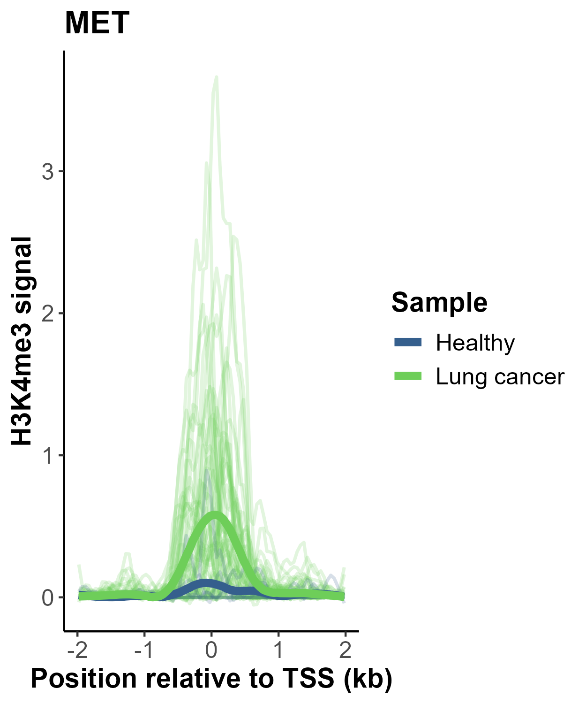
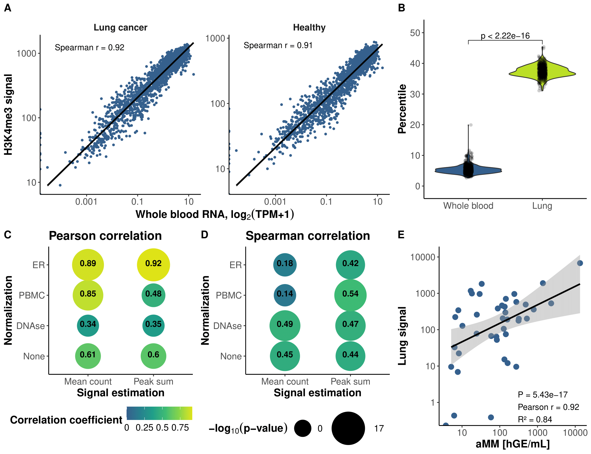

```{r, include=FALSE}
knitr::opts_chunk$set(
    tidy.opts = list(width.cutoff=100),
    tidy = FALSE,
    message = FALSE,
    collapse = TRUE,
    comment = "#>"
)
```
\newpage

# Quick note
Some of this may seem unnecessary to know, but understanding the environment
you are working in, will help you when you face problems. 

If you understand the code you use and avoid excessive copy pastes from 
ChatGPT without knowing how the code works, you will not end up as Ivan or Igor:
    
```{r, echo=FALSE, fig.cap="Fig 1. This is Ivan and Igor. Dont be like Ivan and Igor", out.width='70%'}

```

# R and R-studio

$$R  \neq R_Studio$$
    
**R** is the coding language and the actual machinery performing the analyses.

Different versions of R can be installed in the same R-Studio 

*When you publish, list the R version, not the Rstudio version*
    
**R-studio** is 99% of the times the interface you use when working in R. It is
the most intuitive display of R code and outputs. 

## Suggested R-studio setup:

How you want to setup your R-studio is of course subjective but still I have some
suggestions:
    
1. Always dark mode - It is just the prettier
2. Use three pane view - To add another pane go to View -> Panes -> Add source column (ctrl F7)
3. Separate work into *define*, *execute*, and *plots*
4. Only use R-markdown if you actually use its functions

```{r, echo=FALSE, fig.cap="Fig 2. Suggested R-studio setup. 1, 2, and 3 indicates it is a three pane view in total consisting of 5 windows. For a project it is suggested to separate work into individual files, each with a specific role.", out.width='100%'}

```


### .R files in a project

It is **VERY** important to have a system when working in R. 
R analyses are not easy for anyone and having a structure helps you locate the 
definitions/variables/functions etc. you need. 
It is important to understand how you got to a specific result/plot and having
a good system is the **ONLY** way to obtain this level of transparency 

After some years I have found my system as illustrated in **Fig.2**:
    
My **define** file is where I have ALL my functions (discussed below) and 
nothing else. This means I can run the whole file and all my functions are
defined and I can use these functions to explore my data.

My **execute** file is where I read data and modify/analyse/create the data. 
This is often done using the functions from the *define* file

My **plots** file is where I create the *ready to export* plots, meaning I do 
not perform any analysis in this file. I run functions from the *define* file on
objects created in the *execute* file and save the plots in the correct 
locations.

## Managing files

It is important to maintain good habit of organizing files and 
folders/directories. 
This includes the understanding of a `working directory`, meaning the folder where
R looks for files/folders. If you have created an R project - The location of the
project is the working directory.

Here are some **must** know functions regarding R environments and
data management

```{r,echo=FALSE,highlight=TRUE,messages = FALSE}
library(dplyr)
df <- data.frame(functions = c("getwd()",
                               "setwd('<path>')",
                               "paste0('<string_1>','<string_2>')",
                               "dir.create(<folder>)",
                               "file.create(<file>, overwrite = F)",
                               "list.files('<path>',include.dirs = T,full.names = T,recursive = T)"),
                 description = c("Get the path to working directory",
                                 "Set the working directory as '<path>'",
                                 "Combine character strings as <string_1string_2>",
                                 "Create a folder",
                                 "Create a file without overwriting existing files",
                                 "Get the full path of all files/folders in a folder and subdirectories"))
df %>% 
    knitr::kable() %>% 
    kableExtra::kable_paper(font_size = 18,
                            full_width = F)

```

### Tasks for environment

1. Create a folder called R_workshop
2. Create R_workshop/scripts/
    3. Within R_workshop/scripts/ create three .R files: *workshop_functions.R, workshop_data.R, workshop_plots.R*
    4. Create R_workshop/plots
5. Create R_workshop/data_files
6. Check that the correct files and folders have been created
7. Setup your R studio as shown in **Fig. 2**
    
**Solution:**
    
```{r,eval = FALSE,message=FALSE}
#1
wd <- getwd()
dir.create("R_workshop")
#2
wd <- paste0(wd,"/R_workshop/")
setwd(wd)
dir.create("scripts")
#3
func_file <- "scripts/workshop_functions.R"
data_file <- "scripts/workshop_data.R"
plot_file <- "scripts/workshop_plots.R"
file.create(func_file)
file.create(data_file)
file.create(plot_file)
#4
dir.create("plots")
#5
dir.create("data_files")

#Test everything is correct
list.files(wd,include.dirs = T,full.names = T,recursive = T)
```

# Functions

Creating functions is the only way to avoid mistakes and create consistent 
code and analyses. They enable code to reused but with modifications to e.g.
input files, filter strategies, variables needed to analyzed, groupings etc. 

The general structure of a function is:
    
```{r, eval=FALSE, highlight=TRUE, message=FALSE, echo=TRUE,class.source="fold-show"}

my_function <- function(argument){
    Code using argument
    return(results)
}
# And then the function is used with

my_function(argument)
```

Here argument can be any kind of R object. 

Some key points when you use functions:
    
1. You can define default arguments inside `function()`:
    
```{r, highlight=T,message=F,echo = T,class.source="fold-show"}

my_function <- function(argument = TRUE){
    if(argument){
        return("argument = TRUE")
    }
    else{
        return("argument = FALSE")
    }
}
my_function()
my_function(argument = TRUE)
my_function(argument = FALSE)
```

2. You can create simple tests of the arguments:
    
```{r, highlight=T,message=F,error=TRUE,echo = T,class.source="fold-show"}

my_function <- function(argument = TRUE){
    if(!is.logical(argument)){
        stop("Invalid argument entry\n argument has to be a BOOLEAN/LOGICAL")
    }
    if(argument){
        return("argument = TRUE")
    }
    else{
        return("argument = FALSE")
    }
}
my_function()
my_function(argument = TRUE)
my_function(argument = "Horse")
my_function(argument = FALSE)

```

3. You don't have to return a variable

```{r, highlight=T,message=F,error=TRUE,echo = T,class.source="fold-show"}

my_function <- function(argument = TRUE){
  if(!is.logical(argument)){
    stop("Invalid argument entry\n argument has to be a BOOLEAN/LOGICAL")
  }
  if(argument){
    print("argument = TRUE")
  }
  else{
    print("argument = FALSE")
  }
}
```
4. functions don't have to have arguments

```{r, highlight=T,message=F,error=TRUE,echo = T,class.source="fold-show"}

my_function <- function(){
    samples <- sample(10,3,replace = T)
    sample_sum <- sum(samples)
    if(sample_sum > 15){
        print("Sample sum is high")
    }else{
        print("Sample sum is low")
    }
    print("Sample sum is:")
    return(sample_sum)
}
set.seed(4)
my_function()
set.seed(5)
my_function()
```
## Task for functions

We now try creating some functions using the built-in data set `iris`. 
**Try to use the R-studio formatting we created above.** 
    
Relevant functions for these task:
    
```{r,echo=F,highlight=T,messages = F}
library(dplyr)
df <- data.frame(functions = c("class(<object>)",
                               "str(<object>)",
                               "list('<Entry_1>' = result)",
                               "paste0('<string_1>','<string_2>')",
                               "names(<list>)",
                               "if(<test>){}",
                               #"else{}",
                               "mean(<values>)",
                               "function()",
                               "stop(<message>)",
                               "!",
                               "is.character(<value>)",
                               "is.numeric(<value>)",
                               "is.data.frame(<value>)",
                               "<vector_1> %in% <vector_2>",
                               "colnames(<data.frame>)"),
                 description = c("Gives the type/class of any R object",
                                 "Give the basic structure (class, number of entries etc. in any R object)",
                                 "Create a named where the fist entry is named 'Entry_1' and contains result",
                                 "Combine character strings as <string_1string_2>",
                                 "Gives the names of a list",
                                 "Procedes to what is within {} if test = TRUE",
                                 #"if test = FALSE in previous if() statement then within {} is run",
                                 "Calculates mean value",
                                 "Creates a function",
                                 "Stops the function with an ERROR and sends the <message>",
                                 "Changes TRUE to FALSE and FALSE to TRUE",
                                 "Tests if <value> is a character string",
                                 "Tests if <value> is a numeric value",
                                 "Tests if <value> is a data.frame",
                                 "Tests which entries in vector_1 are also present in vector_2",
                                 "Gives the column names of the data.frame"))
df %>% 
    knitr::kable() %>% 
    kableExtra::kable_paper(font_size = 18,
                            full_width = F)

```

1. Make yourself comfortable with the data set `iris` with e.g. `class()` & `str()`

**Solution:**
    
```{r, highlight=T,message=F,eval=TRUE,echo = T}
class(iris)
str(iris)
class(iris$Sepal.Length)
class(iris[["Sepal.Length"]])
```
2. Create a function `my_func_1()` with a single argument `data` which is set to `iris` as default

This function must be able to calculate the average values of 
`Sepal.Length` & `Sepal.Width` and return the values in a named `list`

**Solution:**
    
```{r, highlight=T,message=F,eval=TRUE,echo = T}

my_func_1 <- function(data = iris){
    len_mean <- mean(data$Sepal.Length)
    wid_mean <- mean(data$Sepal.Width)
    res <- list("Sepal.Length_mean" = len_mean,
                "Sepal.Width_mean" = wid_mean)
    return(res)
}
my_func_1()
```

3. Recreate `my_func_1()` as `my_func_2()`, now with two arguments (`data` & `variable`)

`variable` is a column name existing in `iris` and extract the average values 
for `variable`. 
The function should still return a named list with the average value

**Solution:**
    
```{r, highlight=T,message=F,eval=TRUE,echo = T}

my_func_2 <- function(data = iris,variable){
    avg <- mean(data[[variable]])
    label = paste0(variable,"_mean")
    res <- list(avg)
    names(res) <- label
    return(res)
}
my_func_2(data = iris, variable = "Sepal.Width")
```

4. Recreate `my_func_2()` as `my_func_3()`, but make **tests** that ensures `variable` is the correct class
**and** the data extracted from `variable` can be used to calculate
an average (meaning `variable` contains `numeric` values)

If these requirements are not met the function should give an error (`stop()`)
The function should still return a named list with the average value

**Solution:**
    
```{r, highlight=T,message=F,eval=TRUE,echo = T}

my_func_3 <- function(data = iris,variable){
    if(!is.character(variable)){
        stop("variable has to be a character")
    }
    values <- data[[variable]]
    if(!is.numeric(values)){
        stop(paste0("Values in the variable:\n",
                    variable,"\n",
                    "are not numeric. Select another variable"))
    }
    avg <- mean(values)
    label = paste0(variable,"_mean")
    res <- list(avg)
    names(res) <- label
    return(res)
}
my_func_3(variable = "Sepal.Width")

```

5. Recreate `my_func_3()` as `my_func_4()`, where `data` can be other data sets than `iris` e.g `Puromycin` 
and make sure `variable` only can contain variable names present in the data set used as `data`

The function should still return a named list with the average value

**Solution:**
    
    
```{r, highlight=T,message=F,eval=TRUE,echo = T}

my_func_4 <- function(data = iris,variable){
    if(!is.character(variable)){
        stop("variable has to be a character")
    }
    if(!is.data.frame(data)){
        stop("data has to be a data.frame")
    }
    vars <- colnames(data)
    if(!(variable %in% vars)){
        stop(paste0("The variable:\n",
                    variable,"\n",
                    "does not exist in the data set. Select another variable name"))
    }
    values <- data[[variable]]
    if(!is.numeric(values)){
        stop(paste0("Values in the variable:\n",
                    variable,"\n",
                    "are not numeric. Select another variable"))
    }
    avg <- mean(values)
    label = paste0(variable,"_mean")
    res <- list(avg)
    names(res) <- label
    return(res)
}
my_func_4(variable = "Sepal.Width")

my_func_4(data = Puromycin, variable = "rate")
```

# `tidy`

`tidy` is a "language" within R which is outside of `base` R. It much more powerful
fast, and intuitive than `base` R. I recommend ALWAYS using `tidy` to perform basic
table manipulation, plotting etc. Most `tidy` packages can be loaded with
`library(tidyverse)`, however I recommend loading individual `tidy` packages. 
The most frequently used include:
    
1. `dplyr`
2. `ggplot2`
3. `ggpubr`
4. `tidyr`

So now run:
    
```{r, highlight=T,message=F,eval=TRUE,echo = T,class.source="fold-show"}
library(dplyr)
library(ggplot2)
library(ggpubr)
library(tidyr)
```

## Most relevant `tidy` functions

Here I present some of the most relevant `tidy` functions. We will use these
in later tasks

### ` %>% `

This is called a pipe and it takes a `data.frame` on the left side and 
*pushes* the data into a function on the right side. 
**Good coding practice includes going to a new line after each ` %>% `**
    
    
### `filter()`
    
This is used to filter a data set based on entries in a specific variable:
    
```{r, highlight=T,message=F,eval=TRUE,echo = TRUE,class.source="fold-show"}
iris %>% 
    filter(Species == "virginica") %>% 
    head() # Just to show top 5 rows

iris %>% 
    filter(Petal.Length >= 2) %>% 
    head() # Just to show top 5 rows
```

Usually you would use `filter()` with a variable name and then some kind of logic
test

### `mutate()`

This is used to create a new column in the data set

```{r, highlight=T,message=F,eval=TRUE,echo = TRUE,class.source="fold-show"}
iris %>% 
    mutate(Petal.Classification = ifelse(Petal.Length >= 2,
                                         "long",
                                         "short"),
           .before = "Species") %>% 
    slice(1,2,3,140,141) # Just to show specific rows

iris %>% 
    mutate(Petal.Area = Petal.Length * Petal.Width,
           .before = "Species") %>% 
    slice(1,2,3,140,141) # Just to show specific rows
```

Using `.before`, `.after` you can select where in the data the new column is inserted

### `select()`

This is used to select variables from the data set. 

```{r, highlight=T,message=F,eval=TRUE,echo = TRUE,class.source="fold-show"}
iris %>% 
    select(Petal.Length,Petal.Width) %>% 
    head() # Just to show top 5 rows

iris %>% 
    select(starts_with("Petal")) %>% 
    head() # Just to show top 5 rows

iris %>% 
    select(contains("Width")) %>% 
    head() # Just to show top 5 rows

iris %>% 
    select(-Species) %>% 
    head() # Just to show top 5 rows

```

build in functions e.g. `last_col()` `starts_with()`, `contains()` 
can be used to select specific columns. 
You can select all columns except one (or several) columns with `-`

### `arrange()`

This is used to sort a data set based on one or several columns:
    
```{r, highlight=T,message=F,eval=TRUE,echo = TRUE,class.source="fold-show"}
iris %>% 
    arrange(Petal.Length) %>%
    head() # Just to show top 5 rows

iris %>% 
    arrange(desc(Petal.Length)) %>%
    head() # Just to show top 5 rows

iris %>% 
    arrange(Sepal.Length,Petal.Length) %>%
    head(n = 10) # Just to show top 10 rows
```

`desc()` is used to reverse a given sort order

### `count()`
This is used to count entries based on a given variable

```{r, highlight=T,message=F,eval=TRUE,echo = TRUE,class.source="fold-show"}
iris %>% 
    count(Species)

iris %>% 
    count(Petal.Length >= 2)
```

Can be used count the number of a given entry (similar to `table()`). 
Can also be used to count the number of entries following a logical test.
Works really well in combination with `group_by()` (see below) 

### `group_by()` and `summerise()`/`summarize()`/`reframe()` 

Is used to group the data set based on a single or **multiple** variables.
The *grouped* data set can then be used as input in several functions

```{r, highlight=T,message=F,eval=TRUE,echo = TRUE,class.source="fold-show"}
iris %>% 
    group_by(Species) %>% 
    count() %>% 
    ungroup()

iris %>% 
    group_by(Species) %>% 
    summarise(Petal.Length_mean = mean(Petal.Length),
              Petal.Length_sd = sd(Petal.Length))

iris %>% 
    group_by(Species) %>% 
    reframe(Petal.Length = Petal.Length,
            Petal.Length_mean = mean(Petal.Length),
            Petal.Length_sd = sd(Petal.Length)) %>% 
    slice(1,2,3,140,141) # Just to show specific rows

```

In order to avoid mistakes it is a good idea to include `ungroup()` after you
are done with group manipulations.

`group_by()` works extremely well with 
`summerise()`/`summarize()` or `reframe()`.

It can be hard to differentiate between `summarize()` and `reframe()`. But think
of it as `summarize()` gives a small data set but if you want all original 
entries then use `reframe()`.

### `join()` 

Several join functions exist. They are used to combine `data.frames` based on 
common entries, where column name typically is identical.
I think the following picture very intuitively illustrates the differences
between each type of `join` function. 

```{r, echo=FALSE, fig.cap="Fig 3. How different join functions are used to combine data.frames", out.width='80%'}
knitr::include_graphics("join_fig.png")
```

Here are some examples of how the to use the functions 
*These datasets are unrelated so this specific join is useless*:
    
```{r, highlight=T,message=F,eval=TRUE,echo = TRUE,class.source="fold-show"}
df_1 <- as.data.frame(Indometh) %>% 
    slice(1,12,45) %>% #selecting a few examples
    mutate(Subject = as.character(Subject)) # recreating class
df_1
df_2 <- as.data.frame(Orange) %>% 
    slice(1,10,18) %>%  #selecting a few examples
    mutate(Tree = as.character(Tree))# recreating class
colnames(df_2)[1] <- "Subject" # making sure the relevant variable has the correct name
df_2

df_left <- df_1 %>% 
    left_join(df_2,by ="Subject")
df_left

df_right <- df_1 %>% 
    right_join(df_2,by ="Subject")
df_right

df_full <- df_1 %>% 
    full_join(df_2,by ="Subject")
df_full

df_inner <- df_1 %>% 
    inner_join(df_2,by ="Subject")
df_inner
```

## `tidy` tasks

Use the introduced functions above to complete the following tasks.
**Again remember to use the file formatting introduced above**
    
Additional helpful functions:
    
```{r,echo=F,highlight=T,messages = F}
library(dplyr)
df <- data.frame(functions = c("ifelse(<test>,<if TRUE>,<if FALSE>)",
                               "sum(<values>)",
                               "<vector_1> %in% <vector_2>"),
                 description = c("Returns two different outputs dependent on whether the test is TRUE or FALSE",
                                 "Sums the values in <values>",
                                 "Tests which entries in vector_1 are also present in vector_2"))
df %>% 
    knitr::kable() %>% 
    kableExtra::kable_paper(font_size = 18,
                            full_width = F)

```

1. Create a function `tidy_func_1()` which takes the iris data set as default the `data` argument 
and classifies observations as "long" (Petal.Length >=5) or "short" (Petal.Length < 5).
The resulting `data.frame` must be exported and saved as `iris_mod`

**Solution:**
    
```{r, highlight=T,message=F,eval=TRUE,echo = T}

tidy_func_1 <- function(data = iris){
    df <- data %>% 
        mutate(Petal.Length_class = ifelse(Petal.Length >= 5,
                                           "long","short"))
    return(df)
}

iris_mod <- tidy_func_1()
```

2. Create a function `tidy_func_2()` which takes the output of `tidy_func_1()`
as a default argument and count the number of "long" and "short" 
entries for each `Species` *HINT: use two variable names in group_by()*.
The resulting ungrouped `data.frame` must be exported and saved as `iris_groups`

**Solution:**
    
```{r, highlight=T,message=F,eval=TRUE,echo = T}

tidy_func_2 <- function(data = iris_mod){
    df <- data %>% 
        group_by(Species,Petal.Length_class) %>% 
        count() %>% 
        ungroup()
    return(df)
}
iris_groups <- tidy_func_2()
```

3. Create a function `tidy_func_3()` which takes the output of `tidy_func_2()`
as a default argument and add a column with the percent of "long" and "short" petals
for each species and export the `data.frame` as `iris_group_freq`
*HINT: use group_by() and reframe()*
    
**Solution:**
    
```{r, highlight=T,message=F,eval=TRUE,echo = T}

tidy_func_3 <- function(data = iris_groups){
    df <- data %>% 
        group_by(Species) %>% 
        reframe(Petal.Length_class = Petal.Length_class,
                n = n,
                percent = n/sum(n)*100) %>% 
        ungroup()
    return(df)
}
iris_group_freq <- tidy_func_3()
```

Now we move to another data set, `mtcars`.
Copy the following `data.frame` into `workshop_data.R` and execute

```{r, highlight=T,message=F,eval=TRUE,echo = TRUE,class.source="fold-show"}

mtcars_types <- data.frame(car = c("Mazda RX4",
                                   "Mazda RX4 Wag",
                                   "Datsun 710",
                                   "Merc 240D",
                                   "Merc 230",
                                   "Merc 280",
                                   "Merc 280C",
                                   "Merc 450SE",
                                   "Merc 450SL",
                                   "Merc 450SLC",
                                   "Toyota Corolla",
                                   "Toyota Corona",
                                   "Hornet Sportabout",
                                   "Hornet 4 Drive",
                                   "Valiant",
                                   "Duster 360",
                                   "Cadillac Fleetwood",
                                   "Lincoln Continental",
                                   "Fiat 128"),
                           manufacturer = c("Mazda",
                                            "Mazda",
                                            "Nissan",
                                            rep("Mercedes",7),
                                            "Toyota",
                                            "Toyota",
                                            "AMC",
                                            "AMC",
                                            rep("Other",5)))

```

and rename `mtcars` to `mtcars_mod` then add the rownames of `mtcars` as a variable 
and remove the rownames:
    
```{r, highlight=T,message=F,eval=TRUE,echo = TRUE,class.source="fold-show"}
mtcars_mod <- mtcars
mtcars_mod$car <- rownames(mtcars)
rownames(mtcars_mod) <- NULL

```

4. Create a function `tidy_func_4()` which takes `mtcars_mod` as a default 
argument. Remove the variables `vs`,`disp`,`drat`,`wt` and `am`. Then select cars also present in
`mtcars_types` and add the column with the corresponding manufacturer. 
*HINT: use one of the `join` functions to combine the data.frames*. Then sort
the data set according to `mpg` with the highest value as the first row.
Save the resulting `data.frame` as `mtcars_mod_sele`

**Solution:**
    
```{r, highlight=T,message=F,eval=TRUE,echo = T}

tidy_func_4 <- function(data = mtcars_mod){
    df <- data %>% 
        select(-c(vs,am,disp,drat,wt)) %>% 
        filter(car %in% mtcars_types$car) %>% 
        left_join(mtcars_types, by = "car") %>% 
        arrange(desc(mpg))
    return(df)
}
mtcars_mod_sele <- tidy_func_4()
```

# Saving data

It can often be relevant to save your `data.frames` to save time.
Sometimes you perform extensive analyses, where the output can be relatively 
simple. To save time, save the output and then reload the next time you open R

## Saving as `.txt`

I recommend saving `data.frames` as `.txt` files because it is the most simple 
format (smallest file size). `.txt` files can also be opened in any normal text
editor and can serve as input files for other programs. 
Alternatively you can save as `.csv` or even `.xlsx` so the readout can be opened
in excel. 

## Saving as `.rds`

R also has its own file type for objects, which is called `RDS`. This format is 
super useful when you need to save other R objects than:
    `data.frame`, `tibble`, or `data.table`. This could include `lists`, `vectors`,
and even `plots`. 

## Saving data task

Helpful functions for saving:
```{r,echo=F,highlight=T,messages = F}
library(dplyr)
df <- data.frame(functions = c("saveRDS(<object>, <path>)",
                               "readRDS(<path>)",
                               "write.table(<object>, <path>, sep = '\t')",
                               "read.table(<path>, header = TRUE, sep = '\t')"),
                 description = c("Save an object in the designated path, finish the path with <file_name>.rds",
                                 "Import a .rds object back into R from the path",
                                 "Save a table in the designated path, finish the path with <file_name>.txs",
                                 "Import a table back into R from the path as a data.frame"))
df %>% 
    knitr::kable() %>% 
    kableExtra::kable_paper(font_size = 18,
                            full_width = F)

```

1. in `workshop_data.R` save `mtcars_mod_sele` as `mtcars_mod_sele.txt` in the 
`R_workshop/data_files/` directory and write code to reload the data set.
*HINT: I always suggest to write the FULL PATH as <path>. Use `getwd()` to get*
*the full path to your current directory*

**Solution**

```{r, highlight=T,message=F,eval=FALSE,echo = T}

write.table(mtcars_mod_sele,
            "C:/Users/chris/OneDrive/1PhD/R_workshop_AUH/R_workshop/data_files/mtcars_mod_sele.txt",
            sep = "\t")

mtcars_mod_sele <- read.table("C:/Users/chris/OneDrive/1PhD/R_workshop_AUH/R_workshop/data_files/mtcars_mod_sele.txt",
                              header = TRUE,
                              sep = "\t")

```

# Plots

Plots are the main reason to use R. It is **extremely** flexible and you can 
essentially make any plot you want. 

From the relatively simple boxplots:
    
```{r, echo=FALSE, fig.cap="Fig 4. Boxplot example", out.width='50%'}

```
To the more complex plot types without specific names:
```{r, echo=FALSE, fig.cap="Fig 5. Enrichment track", out.width='50%'}

```
and the complete figures:
    
```{r, echo=FALSE, fig.cap="Fig 6. Complete figure", out.width='80%'}

```

**All of this is made using `tidy` packages**
    
But it is simply impossible for me to explain everything in this workshop.

## `ggplot2`

Similar to `tidy` the `ggplot2` world is a specific language within R.
It follows a very specific structure and works together with the `tidy` format

The basic structure of a `ggplot` is:

```{r, eval = F,highlight=T,message=F,error=TRUE,echo = T,class.source="fold-show"}

df #data.frame with the data

ggplot(data = df, aes(x = var1, y = var2))+ #Define what from the data is used
    geom_xyz()+ # A specific type of data is plotted
    geom_qwe()+ # Another type of data is plotted
    theme()+ #the colors, font sizes, etc. are modified
    labs()+  #the labels are added
    scale_prq() #The scales of the axes, colors, point sizes etc. are modified

```
    
*Notice that in stead of ` %>% ` we use `+`* 
    
**Therefore please go to new line after each `+`**

### `aes`

It is important to understand what goes inside `aes()`:
    
`aes` stands for aesthetics which encompass what variables from the dataset can 
affect how the plot looks in the end. 

`aes` parameters include (but are not limited to):
    
1. x - what is plotted on the first axis
2. y - what is plotted on the second axis
3. fill - What determines the "fill" color of etc. bars and boxes
4. color - what determines the "color" of lines and points 
5. size - what determines the size of lines, points etc.
6. group - what determines how the data should be grouped
7. shape - what determines the shape of lines, points etc.
8. label - where does the labels come from

It is important to understand that `aes()` can be used inside `ggplot()` which
means this variable e.g. determines the color for all `geoms`. Like this:
    
```{r, eval = F,highlight=T,message=F,error=TRUE,echo = T,class.source="fold-show"}

df #data.frame with the data

ggplot(data = df, aes(x = var1, y = var2,# data from var1 and var2 is plotted
                      color = var3))+ # and var3 determines color
    geom_point()+ 
    geom_line() 

```

But `aes` can also be included in the different `geom()` functions. 
This is smart because then two separate variables can determine the color of
e.g. lines. Like this:
    
```{r, eval = F,highlight=T,message=F,error=TRUE,echo = T,class.source="fold-show"}

df #data.frame with the data

ggplot(data = df, aes(x = var1, y = var2))+ # data from var1 and var2 is plotted
    geom_point(aes(color = var3))+ # points colored based on var3
    geom_line(aes(color = var4)) # lines colored based on var4

```

### `geom`

`geoms` are ways to tell `ggplot` what type of plot you want.

`geom` functions include (but are not limited to):
    
1. geom_point - basic points
2. geom_bar - bar graph
3. geom_line - basic lines
4. geom_boxplot - basic boxplot
5. geom_jitter - points randomly jittered
6. geom_text - text labels
7. geom_smooth - Smooth regression line based on data
8. geom_ribbon - Colored area between axis and line
9. geom_vline or geom_hline - vertical or horizontal lines 
10. geom_violin - basic violin plots
11. geom_tile - Sqaures used for heatmaps

### `viridis`, `theme()` and general layout

**I think the default colors in R ugly.** I therefore almost always use the color
pallets in the `viridis` package. They similar to default R colors, but just 
nicer. 

`theme()` is a function to customize the layout of your plot such as font sizes,
angles, font types etc. To generalize things for a project I add the same theme
function to **ALL** plots such as:

```{r, eval = F,highlight=T,message=F,error=TRUE,echo = T,class.source="fold-show"}


#Define theme:
th <- theme(
        legend.background = element_rect(),
        plot.title = element_text(angle = 0, size = 16, face = 'bold', vjust = 1),
        plot.caption = element_text(angle = 0, size = 10, vjust = 1, hjust = 0.37),
        axis.text.x = element_text(angle = 0, size = 12),
        axis.text.y = element_text(angle = 0, size = 12),
        axis.title = element_text(size = 14, face = 'bold'),
        axis.title.x = element_text(size = 14, face = 'bold'),
        axis.title.y = element_text(size = 14, face = 'bold'),
        axis.line = element_line(colour = 'black'),
        legend.text = element_text(size = 12), 
        title = element_text(size = 14, face = "bold"))

df #data.frame with the data

ggplot(data = df, aes(x = var1, y = var2))+ 
    geom_point()+
    th
```

All `ggplot` also have layout themes. 

**NEVER USE THE DEFAULT GGPLOT THEME (theme_grey())!!! IT SCREAMS INEXPERIENCE!**

I suggest adding `theme_bw()`, `theme_classic()`, or `theme_minimal`:

**`theme_grey()` (default)**
```{r, eval = T,highlight=T,message=F,error=TRUE,echo = F}
th <- theme(
        legend.background = element_rect(),
        plot.title = element_text(angle = 0, size = 16, face = 'bold', vjust = 1),
        plot.caption = element_text(angle = 0, size = 10, vjust = 1, hjust = 0.37),
        axis.text.x = element_text(angle = 0, size = 12),
        axis.text.y = element_text(angle = 0, size = 12),
        axis.title = element_text(size = 14, face = 'bold'),
        axis.title.x = element_text(size = 14, face = 'bold'),
        axis.title.y = element_text(size = 14, face = 'bold'),
        axis.line = element_line(colour = 'black'),
        legend.text = element_text(size = 12), 
        title = element_text(size = 14, face = "bold"))

ggplot(iris,aes(x = Petal.Width,y = Petal.Length))+
    geom_point()+
    theme_grey()+
    th
```
**`theme_bw()`**
```{r, eval = T,highlight=T,message=F,error=TRUE,echo = F}

ggplot(iris,aes(x = Petal.Width,y = Petal.Length))+
    geom_point()+
    theme_bw()+
    th
```

**`theme_classic()`**
```{r, eval = T,highlight=T,message=F,error=TRUE,echo = F}

ggplot(iris,aes(x = Petal.Width,y = Petal.Length))+
    geom_point()+
    theme_classic()+
    th
```

**`theme_minimal()`**
```{r, eval = T,highlight=T,message=F,error=TRUE,echo = F}

ggplot(iris,aes(x = Petal.Width,y = Petal.Length))+
    geom_point()+
    theme_minimal()+
    th
```

### Stats in `ggplots`

`ggpubr` is the golden standard package for adding statistical tests to `ggplots`.
It can do **a lot** but `stat_compare_means()` is the standard function to use
for parametric and non-parametric tests of difference.

Example of how it can be used:

```{r, eval = T,highlight=T,message=F,error=TRUE,echo = T,class.source="fold-show"}

CO2 %>% 
    slice(1,2,3,43,44)

ggplot(data = CO2,aes(x = Type, y = uptake))+
    geom_boxplot(aes(fill = Type))+
    scale_fill_viridis_d(begin = 0.2, end = 0.9)+
    theme_classic()+
    stat_compare_means(method = "t.test",
                       paired = FALSE,
                       comparisons = list(c("Quebec","Mississippi")))+
    labs(title = "CO2 uptake in different states")+
    th

```

## Saving `ggplots`

Saving ggplots is quite easy. `ggsave()` is the function to use
generally it works like this:

```{r, eval = F,highlight=T,message=F,error=TRUE,echo = T,class.source="fold-show"}

#Create the plot
gg <- ggplot()

ggsave(filename = "gg.pdf", #File name
       plot = gg, #plot object
       path = "C:/Users/chris/OneDrive/1PhD/R_workshop_AUH/R_workshop/plots/", #path to plot file destinaiton
       dpi = 300, #resolution
       width = 2500, #How wide is the plot
       height = 2500, #How tall is the plot
       units = "px", #What is the unit of width and height px = pixels
       device = "pdf") #file type
```

I often save my plots as `.pdf` because I can get very high resolution and maintain
small file sizes (they save quickly). But otherwise I save as `.png` 
(but lower resolution).

## `ggplot` tasks

1. Create a function (`gg_func_1()`) that creates a boxplot of `mpg` 
for each manufacturer in the `mtcars_mod_sele` data set
*HINT: Use geom_boxplot()*
Save the plot in `R_workshop/plots/` as `gg_1.pdf` from `workshop_plots.R`


**Solution:**

```{r, highlight=T,message=F,eval=FALSE,echo = T}
gg_func_1 <- function(data = mtcars_mod_sele){
    gg <- ggplot(data,aes(x = manufacturer,y = mpg))+
        geom_boxplot()+
        theme_classic()+
        th
    return(gg)
}
gg_1 <- gg_func_1() 

ggsave(filename = "gg_1.pdf",
       plot = gg_1,
       path = "C:/Users/chris/OneDrive/1PhD/R_workshop_AUH/R_workshop/plots/",
       dpi = 300,
       width = 2500, 
       height = 2500, 
       units = "px",
       device = "pdf")

```

2. Create a function (`gg_func_2()`) that creates a boxplot of `mpg` 
for each manufacturer in the `mtcars_mod_sele` data set but also plots the 
individual values as jittered points and each box is colored according to the
manufacturer
*HINT: Use geom_boxplot(outlier.alpha = 0), geom_jitter(), aes(fill = manufacturer)*
Save the plot in `R_workshop/plots/` as `gg_2.pdf` from `workshop_plots.R`

**Solution:**

```{r, highlight=T,message=F,eval=FALSE,echo = T}
gg_func_2 <- function(data = mtcars_mod_sele){
    gg <- ggplot(data,aes(x = manufacturer,y = mpg))+
        geom_boxplot(aes(fill = manufacturer),
                     outlier.alpha = 0)+
        geom_jitter(width = 0.3)+
        scale_fill_viridis_d(begin = 0.2, end = 0.9)+
        theme_classic()+
        th
    return(gg)
}
gg_2 <- gg_func_2()  

ggsave(filename = "gg_2.pdf",
       plot = gg_2,
       path = "C:/Users/chris/OneDrive/1PhD/R_workshop_AUH/R_workshop/plots/",
       dpi = 300,
       width = 2500, 
       height = 2500, 
       units = "px",
       device = "pdf")

```

3. Create a function (`gg_func_3()`) that creates a x/y plot of `Petal.Width`
and `Petal.Length` in the `iris` data set. *Hint use geom_point()*.
Save the plot in `R_workshop/plots/` as `gg_3.pdf` from `workshop_plots.R`

**Solution:**

```{r, highlight=T,message=F,eval=FALSE,echo = T}
gg_func_3 <- function(data = iris){
    gg <- ggplot(data = data, 
                 aes(x = Petal.Width,
                     y = Petal.Length))+
        geom_point()+
        theme_classic()+
        th
    return(gg)
}

gg_3 <- gg_func_3()  

ggsave(filename = "gg_3.pdf",
       plot = gg_3,
       path = "C:/Users/chris/OneDrive/1PhD/R_workshop_AUH/R_workshop/plots/",
       dpi = 300,
       width = 2500, 
       height = 2500, 
       units = "px",
       device = "pdf")

```

4. Create a function (`gg_func_4()`) based on `gg_func_3()` 
that creates a x/y plot of `Petal.Width`and `Petal.Length` in the `iris` data set.
But include an additional argument (`species`) where if it is used it only plots 
for the values for that specific species.
*Hint first filter the data set if species is not NULL (use is.null()) and*
*species = NULL inside function()*.
Save the plots for different species in `R_workshop/plots/` as
`gg_4_<species>.pdf` from `workshop_plots.R`

**Solution:**

```{r, highlight=T,message=F,eval=FALSE,echo = T}
gg_func_4 <- function(data = iris, species = NULL){
    if(!is.null(species)){
        data <- data %>% 
            filter(Species == species)
    }
    gg <- ggplot(data = data, 
                 aes(x = Petal.Width,
                     y = Petal.Length))+
        geom_point()+
        theme_classic()+
        th
    return(gg)
}
gg_4_vir <- gg_func_4(species = "virginica")
gg_4_ver <- gg_func_4(species = "versicolor")   

ggsave(filename = "gg_4_virginica.pdf",
       plot = gg_4_vir,
       path = "C:/Users/chris/OneDrive/1PhD/R_workshop_AUH/R_workshop/plots/",
       dpi = 300,
       width = 2500, 
       height = 2500, 
       units = "px",
       device = "pdf")
ggsave(filename = "gg_4_versicolor.pdf",
       plot = gg_4_ver,
       path = "C:/Users/chris/OneDrive/1PhD/R_workshop_AUH/R_workshop/plots/",
       dpi = 300,
       width = 2500, 
       height = 2500, 
       units = "px",
       device = "pdf")

```

5. Create a function (`gg_func_5()`) based on `gg_func_4()` 
but the plot needs to include the `species` in the title of the plot or if
`specis = NULL` another title has to be included. Also the correlation needs to
be added to the plot.
*Hint use if(){}else{} to define a label to be used inside*
*ggplot()+labs(title = <label>)* *and stat_cor()* 
Save the plots for different species in `R_workshop/plots/` as
`gg_5_<species>.pdf` from `workshop_plots.R`

**Solution:**

```{r, highlight=T,message=F,eval=FALSE,echo = T}
gg_func_5 <- function(data = iris, species = NULL){
    if(!is.null(species)){
        data <- data %>% 
            filter(Species == species)
        lab = species
    } else{
        lab = "All species"
    }
    gg <- ggplot(data = data, 
                 aes(x = Petal.Width,
                     y = Petal.Length))+
        geom_point()+
        theme_classic()+
        labs(title = lab)+
        stat_cor()+
        th
    return(gg)
}
gg_5_vir <- gg_func_5(species = "virginica")
gg_5_ver <- gg_func_5(species = "versicolor")   
gg_5_all <- gg_func_5()

ggsave(filename = "gg_5_virginica.pdf",
       plot = gg_5_vir,
       path = "C:/Users/chris/OneDrive/1PhD/R_workshop_AUH/R_workshop/plots/",
       dpi = 300,
       width = 2500, 
       height = 2500, 
       units = "px",
       device = "pdf")
ggsave(filename = "gg_5_versicolor.pdf",
       plot = gg_5_ver,
       path = "C:/Users/chris/OneDrive/1PhD/R_workshop_AUH/R_workshop/plots/",
       dpi = 300,
       width = 2500, 
       height = 2500, 
       units = "px",
       device = "pdf")
ggsave(filename = "gg_5_all.pdf",
       plot = gg_5_all,
       path = "C:/Users/chris/OneDrive/1PhD/R_workshop_AUH/R_workshop/plots/",
       dpi = 300,
       width = 2500, 
       height = 2500, 
       units = "px",
       device = "pdf")

```

6. Create a function (`gg_func_6()`) which compares the Petal.Length between
the species. You can choose the `geom` you want.
*Hint use stat_compare_means(comparisons = list(c('species_1','species_2')))* 
Save the plot in `R_workshop/plots/` as
`gg_6.pdf` from `workshop_plots.R`

**Solution:**

```{r, highlight=T,message=F,eval=FALSE,echo = T}
gg_func_6_a <- function(data = iris){
    comparisons <- combn(as.character(unique(iris$Species)), 2, simplify = FALSE)
    gg <- ggplot(data,aes(x = Species,y = Petal.Length))+
        geom_boxplot(aes(fill = Species),
                     outlier.alpha = 0)+
        geom_jitter(width = 0.3)+
        theme_classic()+
        scale_fill_viridis_d(begin = 0.2,end = 0.9)+
        stat_compare_means(method = "t.test",
                           comparisons = comparisons)+
        th
    return(gg)
}
gg_6_a <- gg_func_6_a() 
ggsave(filename = "gg_6_a.pdf",
       plot = gg_6_a,
       path = "C:/Users/chris/OneDrive/1PhD/R_workshop_AUH/R_workshop/plots/",
       dpi = 300,
       width = 2500, 
       height = 2500, 
       units = "px",
       device = "pdf")

gg_func_6_b <- function(data = iris){
    comparisons <- combn(as.character(unique(iris$Species)), 2, simplify = FALSE)
    gg <- ggplot(data,aes(x = Species,y = Petal.Length))+
        geom_violin(aes(fill = Species))+
        theme_classic()+
        scale_fill_viridis_d(begin = 0.2,end = 0.9)+
        stat_compare_means(method = "t.test",
                           comparisons = comparisons)+
        th
    return(gg)
}
gg_6_b <- gg_func_6_b() 
ggsave(filename = "gg_6_b.pdf",
       plot = gg_6_b,
       path = "C:/Users/chris/OneDrive/1PhD/R_workshop_AUH/R_workshop/plots/",
       dpi = 300,
       width = 2500, 
       height = 2500, 
       units = "px",
       device = "pdf")

gg_func_6_c <- function(data = iris){
    comparisons <- combn(as.character(unique(iris$Species)), 2, simplify = FALSE)
    gg <- ggplot(data,aes(x = Species,y = Petal.Length))+
        geom_bar(aes(fill = Species),
                 stat = "summary")+
        geom_point()+
        coord_flip()+
        theme_classic()+
        scale_fill_viridis_d(begin = 0.2,end = 0.9)+
        stat_compare_means(method = "t.test",
                           comparisons = comparisons)+
        th
    return(gg)
}
gg_6_c <- gg_func_6_c() 
ggsave(filename = "gg_6_c.pdf",
       plot = gg_6_c,
       path = "C:/Users/chris/OneDrive/1PhD/R_workshop_AUH/R_workshop/plots/",
       dpi = 300,
       width = 2500, 
       height = 2500, 
       units = "px",
       device = "pdf")
```

\newpage
# Session info
It is good practice to include this information in tutorials and manuals to 
ensure reproducibility and for troubleshooting if something does not work.

```{r session, echo = FALSE}
sessioninfo::session_info(
    pkgs = "attached",
    include_base = FALSE,
    dependencies = NA,
    to_file = FALSE
)
```