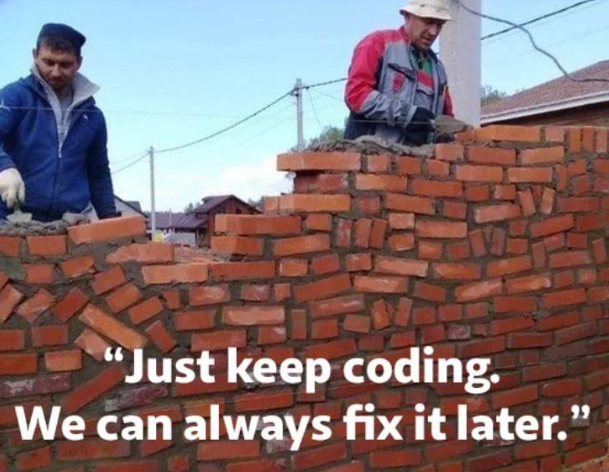

```{r, include=FALSE}
knitr::opts_chunk$set(
    tidy.opts = list(width.cutoff=100),
    tidy = FALSE,
    message = FALSE,
    collapse = TRUE,
    comment = "#>"
)
```
\newpage

# Quick note
Some of this may seem unnecessary to know, but understanding the environment
you are working in, will help you when you face problems. 

If you understand the code you use and avoid excessive copy pastes from 
ChatGPT without knowing how the code works, you will not end up as Ivan or Igor:

```{r, echo=FALSE, fig.cap="Fig 1. This is Ivan and Igor. Dont be like Ivan and Igor", out.width='100%'}

```

# R and R-studio

$$R  \neq R_Studio$$

**R** is the coding language and the actual machinery performing the analyses.

Different versions of R can be installed in the same R-Studio 

*When you publish, list the R version, not the Rstudio version*

**R-studio** is 99% of the times the interface you use when working in R. It is
the most intuitive display of R code and outputs. 

## Suggested R-studio setup:

How you want to setup your R-studio is of course subjective but still I have some
suggestions:

1. Always dark mode - It is just the prettier
2. Use three pane view
3. Separate work into *define*, *execute*, and *plots*
4. Only use R-markdown if you actually use its functions

```{r, echo=FALSE, fig.cap="Fig 2. Suggested R-studio setup. 1, 2, and 3 indicates it is a three pane view in total consisting of 5 windows. For a project it is suggested to separate work into individual files, each with a specific role.", out.width='100%'}

```


### .R files in a project

It is **VERY** important to have a system when working in R. 
R analyses are not easy for anyone and having a structure helps you locate the 
definitions/variables/functions etc. you need. 
It is important to understand how you got to a specific result/plot and having
a good system is the **ONLY** way to obtain this level of transparency 

After some years I have found my system as illustrated in **Fig.2**:

My **define** file is where I have ALL my functions (discussed below) and 
nothing else. This means I can run the whole file and all my functions are
defined and I can use these functions to explore my data.

My **execute** file is where I read data and modify/analyse/create the data. 
This is often done using the functions from the *define* file

My **plots** file is where I create the *ready to export* plots, meaning I do 
not perform any analysis in this file. I run functions from the *define* file on
objects created in the *execute* file and save the plots in the correct 
locations.

# Packages

# Functions

# Tasks

